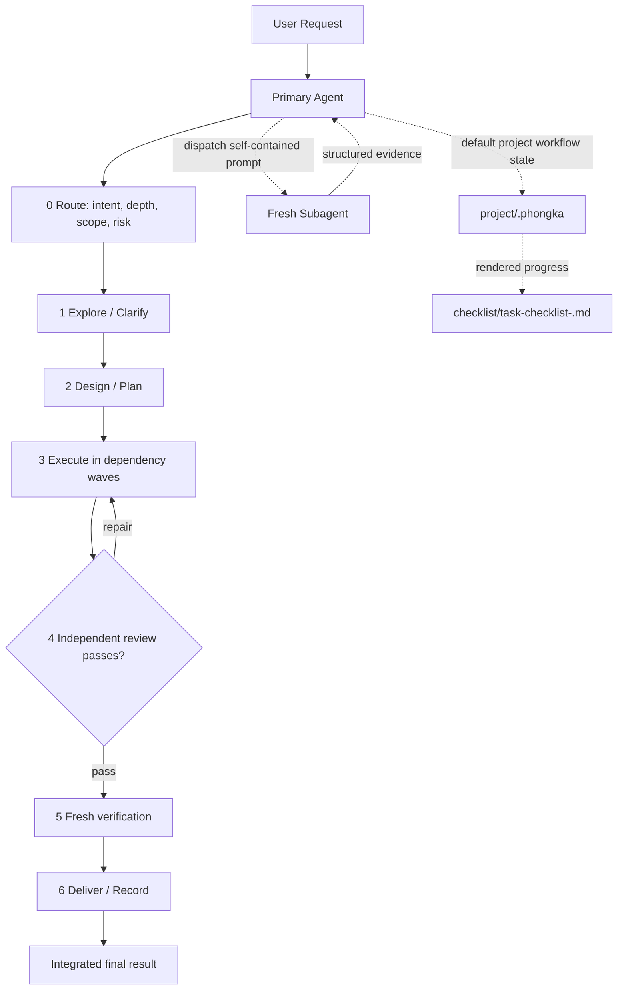

# Architecture

## Workflow



Stages may be compressed, but they remain ordered. Debugging precedes repair. A material edit after review or verification invalidates that evidence. The built-in focused, standard, and controlled depths initialize the project-local `.phongka` runtime by default; a route with an explicit `state_mode: off` remains stateless. Recovery inspects existing state without rebinding; standalone delivery rebinds only an idle runtime and never opens a delivery task.

`agentic-engineering-core` is the sole explicit workflow entrypoint. A host may select it through a native selector, host slash list, `$agentic-engineering-core`, prompt text beginning `/agentic-engineering-core`, or eligible implicit repository work; these are optional activation examples, never prerequisites. The receiving agent remains the sole Primary. The Primary classifies and resolves route/depth, loads the returned `required_skills` in order—core, configured required companions, state when required, then route skills—and owns the terminal report; required companions, including the shared `i-have-adhd` companion, are attached to the Primary and every delegated role prompt/handoff. They shape Primary user-facing output and each role agent's own commentary, handoff, and report, while remaining output guidance only and never becoming stages, agents, owners, or the Primary role. Follow-up steering is limited to the current active `.phongka` workflow/task and is not whole-chat persistence. The provider-neutral host contract and optional provider syntax examples are defined in [host-bootstrap.md](agentic-engineering-core/references/host-bootstrap.md).

## Host contract

At the project boundary, the host exposes `./skills`, loads the relevant `SKILL.md` and prompts, composes the shared envelope plus the selected role prompt, executes ordinary Python CLI/scripts, preserves the universal return fields, and enforces subagent waiting. `.codex-input.json` is not a package contract: it is neither required nor read/written/created by package scripts. Host scratch remains host-owned. Universal handoffs retain `STATUS:`, `SUMMARY:`, `FILES_READ:`, `FILES_CHANGED:`, `EVIDENCE:`, `FINDINGS_OR_IMPLEMENTATION:`, `RISKS:`, `OPEN_QUESTIONS:`, and `NEXT_STEP:`.

## Subagent allocation

| Depth | Max active | Max total | Parallel writers | Repair rounds |
|---|---:|---:|---:|---:|
| focused | 1 | 2 | 1 | 1 |
| standard | 2 | 4 | 1 | 2 |
| controlled | 3 | 6 | 1 | 3 |

The Primary Agent is not counted. Limits are ceilings. Read-only roles may run concurrently. The default single-active-task runtime permits one writer at a time.

## Dispatchable roles

```text
brainstormer
explorer
debugger
planner
implementer
independent-reviewer (plan/task/integration modes)
verifier
recovery
skill-author
```

Every role prompt is stored under its owning skill's `prompts/` directory and is combined with `agentic-engineering-core/prompts/subagent-envelope.md`.

## Runtime

The project-local `.phongka` runtime is the default state boundary for resolved required workflows; an explicit `state_mode: off` route does not create it.

```text
project/.phongka/
├── settings.json             # user-editable subagent wait policy
├── state.json
├── events.jsonl
├── tasks/<task-id>.json
├── artifacts/<task-id>/*.json
├── batch-review.json
├── delivery-decision.json
├── checklist/task-checklist-<task-id>.md # task-specific progress view (render_checklist.py)
└── worktrees/<task-id>/       # controlled source-editing isolation
```

## Subagent waiting

The Primary Agent snapshots `settings.json` at dispatch, computes one total deadline, and polls at the configured check interval. A poll timeout is non-terminal. At the total deadline it checks status once more; it leaves the agent running when `close_on_timeout` is false and may close it only when the field is true. Scripts validate the settings, while the host performs polling and close operations.

## Progress rendering

`render_checklist.py` is the only checklist writer. It validates runtime state, selects an explicit task ID, active task, or latest valid task-bound event in that order, and renders `.phongka/checklist/task-checklist-<task-id>.md`. The Primary Agent refreshes it at stage boundaries with `--task-id`, `--current-stage`, and `--current-skill`; without those markers it only reads the last valid event for the selected task. Every stage through the recorded current stage is checked as reached, later stages remain unchecked, and no marker leaves the stage unknown. Checkboxes mean reached, not completion. Rendering one task does not rewrite another task's file, and legacy checklist README files remain untouched. Scripts never change task status through the checklist.
