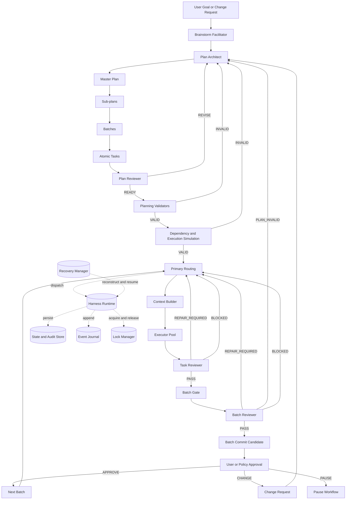
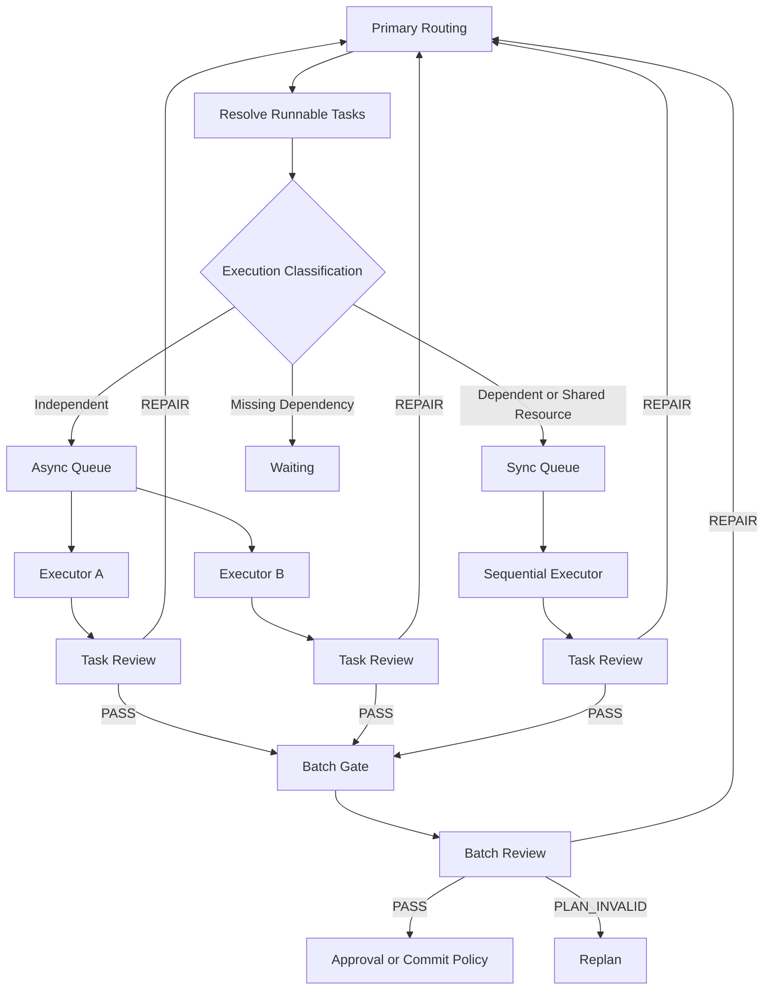
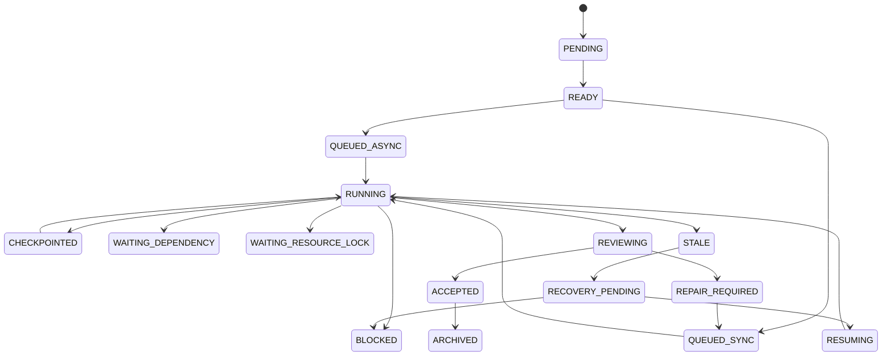
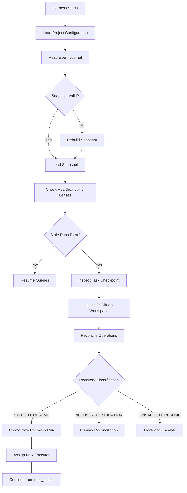

# Agentic Engineering System
## Complete Architecture, Workflow, Global Skills, Review Rubrics, Persistence, and Recovery Specification

**Status:** Finalized Design  
**Language:** English  
**Primary workspace:** `.agent/`  
**Primary design goals:** predictable execution, role separation, adaptive quality control, deterministic validation, resumability, and low-context agent operation.

---

# Table of Contents

1. [Purpose](#1-purpose)
2. [Core Design Principles](#2-core-design-principles)
3. [System Layers](#3-system-layers)
4. [Complete System Architecture](#4-complete-system-architecture)
5. [Agent Roles](#5-agent-roles)
6. [Planning Hierarchy](#6-planning-hierarchy)
7. [Planning Gates](#7-planning-gates)
8. [Progressive Planning](#8-progressive-planning)
9. [Execution Workflow](#9-execution-workflow)
10. [Hybrid Asynchronous and Synchronous Execution](#10-hybrid-asynchronous-and-synchronous-execution)
11. [Blocker Model](#11-blocker-model)
12. [Task State Machine](#12-task-state-machine)
13. [Definition of Ready and Definition of Done](#13-definition-of-ready-and-definition-of-done)
14. [Project Profiles and Adaptive Quality Levels](#14-project-profiles-and-adaptive-quality-levels)
15. [Rubric-Based Review System](#15-rubric-based-review-system)
16. [Review Findings and Severity](#16-review-findings-and-severity)
17. [Deterministic Verdict Calculation](#17-deterministic-verdict-calculation)
18. [Requirement Traceability](#18-requirement-traceability)
19. [Planning Governance](#19-planning-governance)
20. [Global Agent Skill Architecture](#20-global-agent-skill-architecture)
21. [Role-Specific Skill Entry Points](#21-role-specific-skill-entry-points)
22. [Contracts, Schemas, Examples, and Scripts](#22-contracts-schemas-examples-and-scripts)
23. [Persistent `.agent/` Workspace](#23-persistent-agent-workspace)
24. [State Ownership and Sources of Truth](#24-state-ownership-and-sources-of-truth)
25. [Event Journal and State Snapshots](#25-event-journal-and-state-snapshots)
26. [Task Workspace and Checkpoints](#26-task-workspace-and-checkpoints)
27. [Heartbeat, Lease, and Locking](#27-heartbeat-lease-and-locking)
28. [Recovery Workflow](#28-recovery-workflow)
29. [Side-Effect Safety and Idempotency](#29-side-effect-safety-and-idempotency)
30. [Atomic Writes and Concurrency Control](#30-atomic-writes-and-concurrency-control)
31. [Git Branch and Worktree Isolation](#31-git-branch-and-worktree-isolation)
32. [Context Builder and Context Budget](#32-context-builder-and-context-budget)
33. [Agent Capability Registry and Model Routing](#33-agent-capability-registry-and-model-routing)
34. [Bootstrap Modes](#34-bootstrap-modes)
35. [Cancellation, Pause, and Supersede Policies](#35-cancellation-pause-and-supersede-policies)
36. [Conflict Resolution](#36-conflict-resolution)
37. [Approval Matrix and Manual Overrides](#37-approval-matrix-and-manual-overrides)
38. [Security and Data Redaction](#38-security-and-data-redaction)
39. [Retention, Cleanup, and Archiving](#39-retention-cleanup-and-archiving)
40. [Testing the Agent System](#40-testing-the-agent-system)
41. [Configuration Example](#41-configuration-example)
42. [Recommended V1 Scope](#42-recommended-v1-scope)
43. [Deferred Capabilities](#43-deferred-capabilities)
44. [Final Operating Rules](#44-final-operating-rules)

---

# 1. Purpose

This system coordinates multiple subagents to brainstorm, plan, execute, review, integrate, and recover engineering work.

The system is designed for projects ranging from quick personal changes to production-grade systems. It must not force the same level of process, security review, testing, or documentation on every project. Instead, it resolves the required workflow and review rubric from the project profile, task type, task risk flags, and explicit overrides.

The system must:

- Separate planning from execution.
- Separate execution from review.
- Prevent executors from changing architecture or scope without approval.
- Support asynchronous execution for independent tasks.
- Switch to synchronous execution for dependencies, conflicts, repair loops, or blockers.
- Persist all critical workflow state under `.agent/`.
- Recover safely after network loss, agent termination, terminal closure, or process failure.
- Use deterministic scripts for validation whenever a decision can be checked mechanically.
- Require evidence-based rubric scoring instead of reviewer intuition.
- Keep each agent's context small by using a Wiki-style skill system.
- Preserve full traceability from requirements to plans, batches, tasks, tests, and reviews.

---

# 2. Core Design Principles

## 2.1 Role separation

Each role has a limited responsibility:

- Planning agents plan.
- The Primary Agent decides and dispatches under the active policy.
- Executors implement.
- Reviewers evaluate.
- The Harness validates and runs workflows.
- Scripts perform deterministic checks.

No role may silently take over another role's responsibilities.

## 2.2 No guessing

Agents must not infer missing mandatory fields, unresolved requirements, unapproved architecture decisions, or uncertain side-effect outcomes.

Missing required information results in:

- `BLOCKED`
- `NEEDS_RECONCILIATION`
- `REPLAN_REQUIRED`
- or a formal Change Request

depending on the situation.

## 2.3 Machine-verifiable contracts

Agent handoffs must use defined JSON or YAML contracts validated by schemas.

Free-form text may be used for human-readable summaries, but not as the authoritative machine state.

## 2.4 Event-driven persistence

Important state transitions must be written before execution continues.

The append-only event journal is the historical source of truth. Snapshot files exist for fast access and may be rebuilt.

## 2.5 Adaptive rigor

The required quality level is not globally fixed.

The resolved workflow is based on:

```text
Project Profile
+ Task Type
+ Task Risk Flags
+ Explicit Overrides
= Resolved Workflow and Rubric
```

## 2.6 Deterministic validation first

Tasks such as these should be handled by scripts rather than LLM judgment:

- JSON schema validation
- dependency cycle detection
- duplicate ID detection
- rubric score calculation
- hard-fail evaluation
- scope overlap detection
- state transition validation
- state revision checks
- event replay
- stale lease detection

## 2.7 Progressive planning

The entire project may be planned broadly, but only near-term batches should be decomposed into highly detailed atomic tasks.

This avoids maintaining hundreds of stale tasks after requirements or architecture change.

## 2.8 Global skills, project-local state

Reusable skills are installed globally under `$CODEX_HOME/skills` and contain the operating instructions, references, schemas, scripts, and tests required by the agent roles.

The project-local `.agent/` directory is a runtime state store only. It must not contain the global Wiki, skill instructions, planning documentation, or reusable skill resources.

Project-specific plans, task definitions, decisions, requirements, and human-readable reviews belong in the project's documentation area, such as `docs/agentic/`, or in the existing project documentation structure.

## 2.9 Script-owned canonical artifacts

Agents must not hand-write canonical runtime artifacts. They may read state and submit structured payloads, but scripts are responsible for:

- schema validation
- ID and timestamp generation
- revision and transition checks
- lock and lease checks
- atomic writes
- event appends
- snapshot generation and rebuild
- deterministic score and verdict calculation

If a script rejects an agent payload, the workflow must stop with a structured invalid-output or blocked result. Agents must not bypass the script by editing the target state file directly.

---

# 3. System Layers

The system has three main layers.

## 3.1 Planning Layer

Responsible for turning goals into validated executable plans.

Components:

1. Brainstorm Facilitator
2. Plan Architect
3. Plan Reviewer
4. Planning validators and graph simulation

## 3.2 Execution and Review Layer

Responsible for controlled implementation and quality verification.

Components:

1. Primary-controlled execution routing
2. Context Builder
3. Executor Pool
4. Task Reviewer
5. Batch Reviewer

## 3.3 Harness and Persistence Layer

Responsible for durable state, dispatch, concurrency, validation, and recovery.

Components:

1. Harness Runtime
2. State and Audit Store
3. Event Journal
4. Lock Manager
5. Recovery Manager
6. Git Worktree Manager
7. Global state and validation scripts

The persistence boundary is explicit:

```text
Agent
  -> structured payload
  -> global script entry point
  -> schema, transition, lock, and revision validation
  -> atomic write to project-local .agent/
```

Agents may read `.agent/` but may not mutate canonical state files directly.

---

# 4. Complete System Architecture



---

# 5. Agent Roles

## 5.1 Brainstorm Facilitator

The Brainstorm Facilitator explores the problem before formal planning.

Responsibilities:

- Collect goals.
- Collect constraints.
- Identify assumptions.
- Identify unknowns.
- Propose multiple approaches.
- Compare trade-offs.
- Record unresolved decisions.
- Produce a Brainstorm Report.

Prohibited behavior:

- Writing implementation code.
- Selecting a final architecture without sufficient evidence.
- Creating executable tasks directly.
- Modifying runtime state.

Primary outputs:

```text
docs/agentic/brainstorm/current.md
docs/agentic/brainstorm/decisions.jsonl
docs/agentic/assumptions/
```

The Brainstorm Facilitator submits any runtime status update through the global state scripts; it does not write `.agent/` directly.

---

## 5.2 Plan Architect

The Plan Architect converts accepted brainstorming into a hierarchical plan.

Responsibilities:

- Create and version the Master Plan.
- Divide the Master Plan into Sub-plans.
- Divide Sub-plans into Batches.
- Divide near-term Batches into Atomic Tasks.
- Define dependencies.
- Define requirement traceability.
- Define inherited constraints.
- Define acceptance criteria.
- Define risk flags.
- Define task execution budgets.
- Define quality profiles.
- Create Change Requests and update affected artifacts.

Prohibited behavior:

- Executing implementation tasks.
- Approving its own plan.
- Silently modifying accepted decisions.
- Bypassing Plan Review.

---

## 5.3 Plan Reviewer

The Plan Reviewer evaluates plans using a resolved rubric.

Responsibilities:

- Verify goal clarity.
- Verify scope completeness.
- Verify dependency correctness.
- Verify constraint inheritance.
- Verify requirement coverage.
- Verify task atomicity.
- Verify testability.
- Verify task ambiguity.
- Verify risk coverage.
- Verify that executors will not need to redesign the architecture.

Outputs:

```text
PASS
REVISE
BLOCKED
```

The Plan Reviewer may not directly modify the plan.

---

## 5.4 Primary-Controlled Execution Routing

The Primary Agent is responsible for execution routing decisions. This responsibility is intentionally kept in the Primary Agent and is not implemented as a separate Orchestrator skill in the initial global skill set.

Responsibilities:

- Read the active plan from the project documentation area and read runtime state from `.agent/`.
- Determine runnable tasks.
- Resolve `ASYNC`, `SYNC`, or `WAITING`.
- Dispatch tasks through the available agent interfaces.
- Select agents by capability.
- Manage repair loops.
- React to blockers.
- Enforce gates.
- Request approval.
- Pause, cancel, retry, or re-plan according to policy.
- Avoid unrelated execution.

Prohibited behavior:

- Writing implementation code.
- Reviewing code directly.
- Modifying reviewer findings.
- Skipping validation scripts.
- Starting the next batch before required approval.
- Directly editing canonical `.agent/` state files instead of using global state scripts.

---

## 5.5 Context Builder

The Context Builder creates a bounded context package for a task.

Responsibilities:

- Select relevant plan sections.
- Include inherited constraints.
- Include task contract.
- Include relevant decisions.
- Include relevant code files and symbols.
- Include existing patterns.
- Include previous review findings.
- Enforce the context budget.
- Exclude unrelated repository content.
- Redact secrets.

The Context Builder does not make architecture decisions.

---

## 5.6 Executor

The Executor performs exactly one assigned task.

Responsibilities:

- Read the provided context package.
- Inspect only authorized files unless additional context is requested.
- Reuse existing code.
- Follow YAGNI and KISS.
- Modify only approved write scope.
- Run required verification.
- Record commands.
- Create checkpoints.
- Report blockers.
- Create a structured handoff.
- Submit state, checkpoint, and handoff payloads to the global state scripts.

Prohibited behavior:

- Selecting another task.
- Changing architecture.
- Expanding scope.
- Approving its own work.
- Committing or pushing without policy permission.
- Resolving cross-task conflicts independently.
- Repeating uncertain side effects.
- Directly editing canonical files under `.agent/`.

---

## 5.7 Task Reviewer

The Task Reviewer evaluates one task using a resolved rubric.

Responsibilities:

- Validate review inputs.
- Load the matching rubric.
- Collect evidence.
- Score each applicable criterion.
- Mark criteria `N/A` only with evidence.
- Record findings with severity.
- Set hard-fail flags.
- Submit a structured review.
- Submit the review payload to the global review and scoring scripts.

The final verdict is calculated by script, not by reviewer intuition.

The Task Reviewer must not edit implementation files.
The Task Reviewer must not hand-write the canonical review artifact or verdict.

---

## 5.8 Batch Reviewer

The Batch Reviewer evaluates the integrated result of an entire batch.

Responsibilities:

- Confirm required tasks are accepted.
- Verify integration.
- Verify API and schema consistency.
- Verify migration safety.
- Verify regression status.
- Verify end-to-end behavior.
- Verify requirement coverage.
- Verify architecture consistency.
- Verify rollback or recovery readiness where applicable.
- Verify that parallel changes do not conflict.

Outputs:

```text
PASS
REPAIR_REQUIRED
BLOCKED
PLAN_INVALID
```

The Batch Reviewer must not fix implementation directly.

## 5.9 Universal agent-state boundary

All roles follow the same state boundary:

- Agents read global skills and project context.
- Agents produce structured payloads, findings, decisions, or handoffs.
- Global scripts validate and persist canonical runtime artifacts.
- Agents do not directly create or edit `.agent/runtime`, `.agent/work`, `.agent/locks`, `.agent/checkpoints`, `.agent/recovery`, or `.agent/logs` files.
- Agents read back the script-generated result before continuing.

The Primary Agent owns architectural decisions, delegation, and final validation. Runtime routing may be performed by the Primary Agent; a separate Orchestrator skill is not required for the global skill set described here.

---

# 6. Planning Hierarchy

```text
Initiative
└── Master Plan
    ├── Sub-plan
    │   ├── Batch
    │   │   ├── Atomic Task
    │   │   └── Atomic Task
    │   └── Batch
    └── Sub-plan
```

## 6.1 Master Plan

The Master Plan defines:

- Final objective
- In-scope
- Out-of-scope
- System architecture
- Major workstreams
- Milestones
- High-level dependencies
- Global constraints
- Success criteria
- Major risks
- Completion conditions

## 6.2 Sub-plan

A Sub-plan is a major workstream with a verifiable output.

Examples:

- Backend Foundation
- Frontend Foundation
- AI Pipeline
- Infrastructure
- Data Migration
- Testing and Evaluation
- Observability

A Sub-plan must not be merely a documentation chapter.

## 6.3 Batch

A Batch is a reviewable, integratable increment.

Good example:

```text
Batch: Complete Product Read API
```

Bad example:

```text
Batch: Modify Backend Files
```

A Batch contains:

- Objective
- Dependencies
- Task list
- Integration criteria
- Batch Definition of Done
- Review profile
- Commit conditions

## 6.4 Atomic Task

An Atomic Task is the smallest unit assigned to an Executor.

A task must define:

- One primary objective
- Context
- Dependencies
- Read scope
- Write scope
- Inputs
- Required outputs
- Acceptance criteria
- Verification
- Out-of-scope
- Risk flags
- Blocker policy
- Execution budget
- Plan and artifact versions

Example:

```yaml
task_id: SP-01-B03-T02
title: Implement product detail endpoint

objective:
  Implement the product detail API using the existing repository.

context:
  The frontend requires a stable product detail contract.

depends_on:
  - SP-01-B03-T01

execution_mode: auto
task_type: backend

read_scope:
  - backend/src/products/
  - backend/src/database/

write_scope:
  - backend/src/products/controller.ts
  - backend/src/products/service.ts

inputs:
  - Product schema
  - Existing repository interface

required_outputs:
  - GET /api/products/:id
  - Not-found handling

acceptance_criteria:
  - Returns the expected product payload
  - Returns 404 for an unknown product
  - Does not expose internal database fields

verification:
  - Unit tests
  - API integration tests
  - Type-check
  - Lint

out_of_scope:
  - Product update endpoint
  - Product recommendations

risk_flags:
  external_input: true
  authentication: false
  authorization: false
  sensitive_data: false
  database_write: false
  destructive_operation: false
  migration: false
  public_api: true

blocker_policy:
  hard_blockers:
    - Product schema is unavailable

execution_budget:
  max_files_changed: 6
  max_new_dependencies: 0
  allow_schema_change: false
  allow_architecture_change: false
```

---

# 7. Planning Gates

## 7.1 Brainstorm Gate

Requirements:

- Goal is sufficiently clear.
- Constraints are recorded.
- Important assumptions are recorded.
- Relevant options were compared.
- Critical unknowns are either resolved or explicitly tracked.

## 7.2 Master Plan Gate

Requirements:

- Scope is coherent.
- Architecture is internally consistent.
- Major workstreams are present.
- Success criteria exist.
- Obvious over-engineering is absent.
- Major risks are identified.

## 7.3 Sub-plan Gate

Requirements:

- The Sub-plan has a verifiable output.
- Responsibilities do not overlap incorrectly.
- Dependencies are explicit.
- The Sub-plan can be divided into Batches.

## 7.4 Batch Gate

Requirements:

- The Batch produces a meaningful increment.
- Integration criteria exist.
- Task dependencies are known.
- Async and sync candidates are identified.
- Batch review criteria exist.

## 7.5 Task Ready Gate

Requirements:

- Objective exists.
- Context exists.
- Scope exists.
- Acceptance criteria exist.
- Verification exists.
- Out-of-scope exists.
- Required context is available.
- No unresolved hard blocker exists.
- The Executor is not required to make an architecture decision.

Only tasks passing this gate may be dispatched.

---

# 8. Progressive Planning

The system uses rolling-wave planning.

Recommended detail levels:

- Master Plan: detailed
- All Sub-plans: medium detail
- Near-term Batches: detailed
- Atomic Tasks: only for the next one or two Batches

Workflow:

```text
Plan broadly
→ Detail near-term Batches
→ Execute
→ Review actual results
→ Refine future Batches
```

This limits stale planning artifacts.

---

# 9. Execution Workflow



---

# 10. Hybrid Asynchronous and Synchronous Execution

## 10.1 Asynchronous execution

Use async execution when:

- Tasks are independent.
- Tasks do not write the same files.
- Tasks do not require the same exclusive resource.
- Contracts are stable.
- No shared schema change is involved.
- Tasks can be reviewed independently.
- Completion order does not affect correctness.

## 10.2 Synchronous execution

Use sync execution when:

- One task depends on another task's output.
- Tasks modify the same file or module.
- A database migration is involved.
- An API contract changes.
- A shared schema changes.
- An architecture decision is required.
- A reviewer requests repair.
- A sensitive side effect is involved.
- A user approval gate is required.

## 10.3 Default routing rule

```text
Async is the default for independent tasks.

Sync is activated by:
dependency,
shared resource,
repair,
conflict,
architecture decision,
hard blocker,
or approval gate.
```

---

# 11. Blocker Model

## 11.1 Hard Blocker

The task cannot continue.

Examples:

- Required dependency is incomplete.
- Required contract is undecided.
- Required schema does not exist.
- Required resource is unavailable.
- Requirement is materially ambiguous.

Actions:

- Current task → `WAITING` or `BLOCKED`
- Dependent tasks → `BLOCKED`
- Independent tasks → continue

## 11.2 Soft Blocker

The task can continue partially.

Examples:

- Real data is unavailable but fixtures can be used.
- Integration is unavailable but an interface can be implemented.
- Full test environment is unavailable but implementation can proceed.

Actions:

- Continue unaffected work.
- Record assumptions.
- Do not mark task complete.

## 11.3 Conflict Blocker

Two tasks require the same resource.

Actions:

- Lock the resource.
- Allow one task to continue.
- Move the other task to `WAITING_RESOURCE_LOCK`.
- Let the Primary Agent reorder, merge, or re-plan under the approved scope.

## 11.4 Review Blocker

A reviewer discovers an issue affecting dependent work.

Actions:

- Failed task → `REPAIR_REQUIRED`
- Dependent tasks → `WAITING`
- Independent tasks → continue
- Batch Review → blocked

---

# 12. Task State Machine



Supported states:

```text
PENDING
READY
QUEUED_ASYNC
QUEUED_SYNC
RUNNING
CHECKPOINTED
WAITING_DEPENDENCY
WAITING_RESOURCE_LOCK
BLOCKED
REVIEWING
REPAIR_REQUIRED
ACCEPTED
STALE
RECOVERY_PENDING
RESUMING
PAUSED
DEFERRED
CANCELLED
SUPERSEDED
ABORTED_UNSAFE
ESCALATED
ARCHIVED
```

## 12.1 State transition invariants

The Harness must reject invalid transitions.

Examples:

```text
READY → RUNNING                    valid
RUNNING → REVIEWING                valid
REVIEWING → ACCEPTED               valid
PENDING → ACCEPTED                 invalid
BLOCKED → ACCEPTED                 invalid
STALE → RUNNING                    invalid
STALE → RECOVERY_PENDING           valid
```

Transition specification example:

```yaml
transition:
  from: RUNNING
  to: REVIEWING
  required_actor: executor
  required_artifacts:
    - handoff.json
    - checkpoint.json
  required_conditions:
    - no_unresolved_hard_blocker
```

---

# 13. Definition of Ready and Definition of Done

## 13.1 Definition of Ready

```yaml
definition_of_ready:
  objective_defined: true
  scope_defined: true
  dependencies_resolved: true
  acceptance_criteria_defined: true
  verification_defined: true
  constraints_inherited: true
  context_package_available: true
  write_scope_available: true
  no_unresolved_hard_blocker: true
```

## 13.2 Definition of Done

```yaml
definition_of_done:
  implementation_complete: true
  acceptance_criteria_passed: true
  required_verification_passed: true
  documentation_updated_when_required: true
  reviewer_accepted: true
  no_unresolved_blocker: true
```

Executor completion does not equal task completion.

A task is complete only after review acceptance.

---

# 14. Project Profiles and Adaptive Quality Levels

The system must not apply production-level review to every project.

## 14.1 Project profiles

Recommended profiles:

| Profile | Intended use |
|---|---|
| `prototype` | Fast idea validation |
| `quick_change` | Small repair or modification |
| `personal` | Personal or local-only project |
| `course_project` | Academic assignment |
| `internal_tool` | Internal team utility |
| `production` | Public or business-critical product |
| `high_risk` | Sensitive or regulated system |

Example:

```yaml
project_profile:
  type: personal
  delivery_mode: quick_change
  deployment: local_only
  data_sensitivity: none
  user_exposure: single_user
  quality_level: lightweight
```

## 14.2 Quality levels

### Lightweight

Recommended for:

- prototypes
- quick fixes
- small personal projects

Core criteria:

- correctness
- requirement alignment
- scope compliance
- basic maintainability
- targeted verification

Conditional criteria:

- security
- performance
- documentation
- accessibility

### Standard

Recommended for:

- course projects
- larger personal applications
- internal tools

Core criteria:

- correctness
- requirement alignment
- scope compliance
- reuse
- YAGNI and KISS
- maintainability
- testing
- error handling

Conditional criteria:

- security
- performance
- accessibility
- observability

### Strict

Recommended for production systems.

Core criteria include:

- correctness
- testing
- security
- maintainability
- compatibility
- observability
- rollback
- performance
- documentation

### Critical

Recommended for high-risk systems.

Additional requirements may include:

- threat modeling
- audit trail
- migration rehearsal
- recovery testing
- manual approval
- strict hard gates
- no automatic safety overrides

---

# 15. Rubric-Based Review System

All reviewers must use detailed rubrics.

Reviewers must not issue subjective judgments such as:

```text
The code looks fine.
The architecture seems acceptable.
```

Each rubric criterion must define:

- criterion ID
- title
- weight
- scoring scale
- scoring anchors
- applicability rules
- minimum score
- evidence requirements
- hard-fail behavior

Example:

```yaml
rubric_id: TASK_REVIEW_BACKEND_V1
version: 1.0
review_type: task
task_type: backend

scoring:
  scale:
    0: Missing or fundamentally incorrect
    1: Major deficiencies
    2: Partially acceptable
    3: Meets requirements
    4: Exceeds requirements without over-engineering

  pass_threshold_percent: 85

hard_fail_rules:
  - acceptance_criteria_not_met
  - critical_security_issue
  - required_verification_failed
  - changes_outside_write_scope
  - unresolved_major_correctness_issue

criteria:
  - id: CORRECTNESS
    title: Functional correctness
    weight: 25
    mandatory: true
    evidence_required: true

  - id: REQUIREMENT_ALIGNMENT
    title: Requirement alignment
    weight: 15
    mandatory: true
    evidence_required: true

  - id: TESTING
    title: Test quality and coverage
    weight: 15
    mandatory: true
    evidence_required: true

  - id: REUSE
    title: Reuse of existing components
    weight: 10
    mandatory: false
    evidence_required: true

  - id: YAGNI_KISS
    title: Simplicity and scope discipline
    weight: 10
    mandatory: false
    evidence_required: true

  - id: MAINTAINABILITY
    title: Maintainability
    weight: 10
    mandatory: false
    evidence_required: true

  - id: SECURITY
    title: Application security
    weight: 10
    mandatory: false
    applicability: conditional

  - id: PERFORMANCE
    title: Relevant performance considerations
    weight: 5
    mandatory: false
    applicability: conditional
```

---

# 16. Review Findings and Severity

Each finding must include evidence and a required action.

Example:

```json
{
  "finding_id": "FIND-003",
  "severity": "MAJOR",
  "category": "correctness",
  "file": "backend/src/products/service.ts",
  "location": "ProductService.findById",
  "evidence": "The repository may return null but the result is dereferenced.",
  "required_change": "Handle null and return ProductNotFoundError.",
  "blocking": true
}
```

Severity levels:

## 16.1 Critical

Examples:

- Severe security vulnerability
- Data loss risk
- Destructive migration
- Fundamental architecture violation
- Main requirement not implemented

## 16.2 Major

Examples:

- Acceptance criterion not met
- Important logic is incorrect
- Required verification failed
- Significant out-of-scope change
- Important validation missing
- Significant duplicate logic

## 16.3 Minor

Examples:

- Maintainability issue
- Weak naming
- Missing non-critical edge test
- Incomplete documentation

## 16.4 Suggestion

Examples:

- Optional improvement
- Style preference
- Non-blocking optimization

Suggestions must not cause infinite repair loops.

---

# 17. Deterministic Verdict Calculation

Reviewers supply:

- criterion scores
- evidence
- findings
- applicability decisions
- hard-fail flags

Scripts calculate:

- weighted score
- adjusted denominator
- mandatory criterion compliance
- hard-fail result
- final verdict

Verdict rule:

```text
PASS only when:
- final score meets the threshold,
- no hard fail exists,
- no unresolved CRITICAL finding exists,
- no unresolved MAJOR finding exists,
- all mandatory applicable criteria meet their minimum score.
```

Example:

```text
Score: 92/100
Security: 0/4
Critical security issue: true
Verdict: REPAIR_REQUIRED
```

The high score does not override the hard fail.

---

## 17.1 Applicability

Each conditional criterion must be classified as:

```text
APPLICABLE
NOT_APPLICABLE
INSUFFICIENT_CONTEXT
```

`NOT_APPLICABLE` must include evidence.

Example:

```yaml
security:
  applicability: NOT_APPLICABLE
  score: null
  reason: >
    The task only modifies static presentation styles and introduces no
    external input, authentication, data handling, network behavior,
    dependency change, or destructive operation.
```

`N/A` criteria are removed from the denominator.

## 17.2 Baseline safety versus application security

Baseline safety always applies:

- Do not commit secrets.
- Do not delete unrelated data.
- Do not run dangerous commands without authorization.
- Do not modify outside scope.
- Do not add unapproved dependencies.

Application security is conditional:

- authentication
- authorization
- injection
- input validation
- sensitive data
- file upload
- public APIs
- network exposure
- token and session handling
- rate limiting

---

# 18. Requirement Traceability

ID structure:

```text
MP-01
SP-01
SP-01-B03
SP-01-B03-T02
```

Task linkage:

```yaml
master_plan: MP-01
sub_plan: SP-01
batch: SP-01-B03
task: SP-01-B03-T02
```

Traceability chain:

```text
REQ-014
→ SP-03
→ SP-03-B02
→ SP-03-B02-T01
→ TEST-041
```

The system should detect:

- requirements without tasks
- tasks without requirements
- acceptance criteria without verification
- requirements lost during decomposition
- superseded tasks still linked to active requirements

---

# 19. Planning Governance

## 19.1 Constraint inheritance

Constraint levels:

```text
Global constraints
Sub-plan constraints
Batch constraints
Task-specific constraints
```

Lower-level artifacts may not override higher-level constraints without an accepted decision or Change Request.

## 19.2 Decision Log

```yaml
decision_id: DEC-014
decision: Use PostgreSQL instead of SQLite
reason: Concurrent workers require stronger write coordination
affects:
  - SP-02
  - SP-04
status: accepted
```

## 19.3 Assumption Register

```yaml
assumption_id: ASM-006
assumption: External API supports 100 requests per minute
impact_if_wrong: Batch processing strategy must change
status: unverified
```

## 19.4 Risk Register

```yaml
risk_id: RISK-012
description: API provider may impose lower rate limits
probability: medium
impact: high

mitigation:
  - Add exponential backoff
  - Add request queue

trigger:
  - HTTP 429 exceeds threshold

owner: SP-04
```

A risk may happen. A blocker has already happened.

## 19.5 Change Control

```yaml
change_id: CHG-008
source: user
reason: Replace Qdrant with Neo4j

affected_items:
  - SP-02
  - SP-04-B01
  - SP-04-B02-T03

severity: structural
status: pending_analysis
```

After analysis, the Primary Agent may:

- cancel obsolete tasks
- supersede old tasks
- update dependencies
- create replacement tasks
- require reconciliation
- trigger re-review

## 19.6 Versioning

```text
Master Plan v1.2
Sub-plan SP-02 v1.4
Batch SP-02-B03 v2.0
Task SP-02-B03-T04 v2.1
```

Running tasks must record exact versions.

Plan changes must be classified:

```text
NON_BREAKING
REQUIRES_RECONCILIATION
INVALIDATES_RUNNING_TASK
```

---

# 20. Global Agent Skill Architecture

The reusable skill system is installed globally under `$CODEX_HOME/skills`.

`SKILL.md` is the entry point, startup policy, and routing guide for one skill. Detailed rules, schemas, examples, and deterministic scripts are bundled with the relevant global skill and loaded progressively.

Cross-role defaults and model routing are centralized in `agentic-configuration/config/agentic-config.yaml`; role skills and runtime scripts must read that skill instead of copying configuration literals.

The project must not contain `.agent/wiki/`. Project-local `.agent/` is reserved for runtime state and status. Project-specific plans, task definitions, decisions, requirements, and human-readable reviews belong in the project's documentation area, such as `docs/agentic/`.

Shared architecture, role, workflow, policy, contract, profile, and rubric guidance is installed in the `agentic-engineering-wiki` package. Existing role packages may retain compatibility references, but new shared policy must be added to the Wiki and routed from each role entry point.

The executable state source is `agentic-state-tools/schemas/state-machine.json`. Runtime consumers and task/event schemas must be validated against that source; queue, dependency graph, dispatch, recovery, lock, lease, review, approval, and change artifacts are generated or validated through `agentic-state-tools`.

Recommended global structure:

```text
$CODEX_HOME/skills/
├── agentic-configuration/
│   ├── SKILL.md
│   ├── agents/openai.yaml
│   ├── config/agentic-config.yaml
│   ├── schemas/agentic-config.schema.json
│   └── scripts/load_config.py
│
├── agentic-engineering-wiki/
│   ├── SKILL.md
│   ├── agents/openai.yaml
│   ├── refs/
│   ├── schemas/
│   ├── scripts/
│   └── tests/
│
├── agentic-engineering-core/
│   ├── SKILL.md
│   ├── agents/openai.yaml
│   ├── references/
│   │   ├── architecture/
│   │   ├── roles/
│   │   ├── workflows/
│   │   ├── policies/
│   │   └── contracts/
│   └── tests/
│
├── agentic-explorer/
│   ├── SKILL.md
│   ├── agents/openai.yaml
│   └── references/
│
├── agentic-implementer/
│   ├── SKILL.md
│   ├── agents/openai.yaml
│   └── references/
│
├── agentic-context-builder/
├── agentic-task-reviewer/
├── agentic-batch-reviewer/
├── agentic-runtime-recovery/
│
└── agentic-state-tools/
    ├── SKILL.md
    ├── agents/openai.yaml
    ├── schemas/
    ├── scripts/
    ├── examples/
    └── tests/
```

The initial global skill set does not require an Orchestrator skill. The Primary Agent retains architectural ownership, delegation, routing, and final validation.

The planning role entry points are `agentic-brainstorm-facilitator`, `agentic-plan-architect`, and `agentic-plan-reviewer`; they produce and review planning contracts but do not replace Primary Agent routing.

---

# 21. Role-Specific Global Skill Entry Points

The system may provide thin global role entry points:

```text
$CODEX_HOME/skills/agentic-explorer/SKILL.md
$CODEX_HOME/skills/agentic-brainstorm-facilitator/SKILL.md
$CODEX_HOME/skills/agentic-plan-architect/SKILL.md
$CODEX_HOME/skills/agentic-plan-reviewer/SKILL.md
$CODEX_HOME/skills/agentic-implementer/SKILL.md
$CODEX_HOME/skills/agentic-context-builder/SKILL.md
$CODEX_HOME/skills/agentic-task-reviewer/SKILL.md
$CODEX_HOME/skills/agentic-batch-reviewer/SKILL.md
$CODEX_HOME/skills/agentic-runtime-recovery/SKILL.md
```

Each role skill reads `agentic-configuration` for routing/defaults, the shared `agentic-engineering-wiki` package and relevant pages from `agentic-engineering-core`, then reads project documentation and active runtime state from `.agent/`.

The V1 release gate requires the state source validator, planning/queue/rubric/recovery contract checks, the integrated V1 workflow tests, all bundled example checks, Python compilation, JSON parsing, and every installed skill metadata validator to pass. The package must not be labeled V1 when any P1 invariant remains unverified.

Example:

````markdown
# Task Reviewer

Read in order:

1. `agentic-engineering-core/SKILL.md`
2. The task-reviewer role reference
3. The review contract
4. The rubric matching the active task type
5. The active task specification from the project documentation area
6. The Executor handoff payload
7. The actual Git diff

Required validation:

```text
Use agentic-state-tools to validate the review payload and calculate the rubric verdict.
```

Do not issue a verdict without a completed rubric and script-generated result.
````

## 21.1 Recommended startup reading

### Explorer

```text
agentic-engineering-core/SKILL.md
→ role/explorer
→ scope-policy
→ active task or investigation request
→ authorized repository files
```

### Implementer

```text
agentic-engineering-core/SKILL.md
→ role/implementer
→ task-execution-loop
→ scope-policy
→ checkpoint-policy
→ task contract from project documentation
→ active context package
```

### Task Reviewer

```text
agentic-engineering-core/SKILL.md
→ role/task-reviewer
→ review contract
→ resolved rubric
→ task specification
→ executor handoff
→ Git diff
```

### Runtime Recovery

```text
agentic-engineering-core/SKILL.md
→ runtime and recovery references
→ project .agent/runtime state
→ agentic-state-tools validation and rebuild scripts
```

---

# 22. Contracts, Schemas, Examples, and Scripts

## 22.1 Global references

Global skill references contain reusable policies and rules. They are read-only inputs for agents and must not be copied into `.agent/`.

## 22.2 Examples

Examples bundled with global skills are valid examples only. They do not override contracts or policies.

## 22.3 Schemas

Machine-readable schemas are bundled with `agentic-state-tools`. Required payloads and runtime artifacts must pass schema validation before use.

## 22.4 Script-owned artifacts

Agents do not hand-write canonical runtime files. They submit structured payloads through `agentic-state-tools`.

The scripts are responsible for:

- generating runtime state and status files
- appending immutable events
- assigning IDs and timestamps
- checking revisions, transitions, locks, and leases
- writing atomically
- rebuilding snapshots from the event journal
- generating checkpoints, handoffs, and reviews
- calculating rubric scores and verdicts
- inspecting recovery safety
- validating planning contracts and dependency graphs
- resolving profiles, rubrics, runnable tasks, and execution mode
- recording approvals and scope-conflict evidence

Representative scripts include:

```text
init_runtime.py
append_event.py
update_task_state.py
create_checkpoint.py
create_handoff.py
create_review.py
create_batch_review.py
create_context.py
acquire_lock.py
release_lock.py
record_heartbeat.py
record_operation.py
render_checklist.py
validate_schema.py
validate_transition.py
calculate_rubric_score.py
rebuild_state.py
inspect_recovery.py
validate_planning.py
validate_dependency_graph.py
detect_scope_overlap.py
resolve_project_profile.py
resolve_rubric.py
resolve_runnable_tasks.py
resolve_execution_mode.py
record_approval.py
```

Scripts must not contain subjective architecture decisions. They enforce contracts and persist the decisions supplied by the authorized agent or policy.

## 22.5 Invalid output policy

When an agent payload fails schema or policy validation:

1. Reject the payload.
2. Allow one focused format correction attempt.
3. If still invalid, mark:
   - `BLOCKED_INVALID_OUTPUT`
   - or `ESCALATED`
4. Do not guess missing fields.
5. Do not allow direct manual edits to the rejected canonical artifact.

---

# 23. Persistent `.agent/` Workspace

`.agent/` is the project-local runtime state and status store. It is not a Wiki, skill package, planning repository, or documentation area.

Only global scripts from `agentic-state-tools` may create or mutate canonical files under `.agent/`. Agents read these files and submit structured payloads to the scripts.

Recommended runtime structure:

Task work directories may also contain generated `context.json`, `lease.json`,
`handoff.json`, and task-review `review.json` artifacts. Batch reviews use the
same `review.json` name under the batch ID directory.

```text
.agent/
├── checklist.md
├── runtime/
│   ├── state.json
│   ├── events.jsonl
│   ├── agents.json
│   ├── queue.json
│   └── graph.json
├── work/
│   └── <task-id>/
│       ├── task-state.json
│       ├── checkpoint.json
│       ├── commands.jsonl
│       ├── operations.jsonl
│       ├── changed-files.json
│       ├── outputs.json
│       ├── blockers.json
│       └── handoff.json
├── checkpoints/
│   ├── global/
│   └── agents/
├── locks/
│   ├── tasks/
│   ├── files/
│   └── resources/
├── recovery/
│   ├── recovery-state.json
│   ├── stale-runs.json
│   └── recovery-log.jsonl
├── logs/
│   ├── executors/
│   ├── reviewers/
│   └── harness/
```

The following do not belong under `.agent/`:

- global skill instructions and references
- reusable schemas, scripts, and examples
- Master Plans, Sub-plans, Batches, and task definitions
- decision, assumption, risk, and change-control documents
- human-readable progress notes or project documentation
- project configuration files; keep them in the project documentation/configuration area

Place those artifacts in `$CODEX_HOME/skills` when reusable globally, or in the project's documentation area when project-specific.

`.agent/checklist.md` is the user-facing status projection. It is generated by `agentic-state-tools` from task state, review results, and the active batch. The script marks a task `[x]` only when the task meets its completion gate; otherwise it remains `[ ]`.

The checklist is readable by the user but is not an authoritative source of workflow state. Manual edits may be overwritten during regeneration.

---

# 24. State Ownership and Sources of Truth

| Data | Authoritative source |
|---|---|
| Historical transitions | `runtime/events.jsonl` |
| Current task state | `work/<task-id>/task-state.json` |
| Dependency graph | `runtime/graph.json` |
| Task definition | Project documentation area, for example `docs/agentic/tasks/<task-id>.yaml` |
| Current locks | `locks/` |
| Final task review | `work/<task-id>/review.json` |
| Final batch review | `work/<batch-id>/review.json` |
| Fast global snapshot | `runtime/state.json` |
| Recovery checkpoint | `work/<task-id>/checkpoint.json` |
| User-facing task checklist | `checklist.md` (generated projection, not authoritative) |

The project documentation area is authoritative for human-authored planning artifacts. The `.agent/` files are authoritative only for runtime state and status.

`state.json` is a script-generated snapshot, not the complete historical truth. The event journal is the historical source of truth.

---

# 25. Event Journal and State Snapshots

## 25.1 Append-only event journal

Example:

```json
{"event_id":"EVT-001","timestamp":"2026-08-02T09:15:00+07:00","type":"TASK_QUEUED","task_id":"SP-01-B01-T01","actor":"primary-agent"}
{"event_id":"EVT-002","timestamp":"2026-08-02T09:15:03+07:00","type":"TASK_STARTED","task_id":"SP-01-B01-T01","actor":"executor-01","run_id":"RUN-014"}
{"event_id":"EVT-003","timestamp":"2026-08-02T09:21:40+07:00","type":"CHECKPOINT_CREATED","task_id":"SP-01-B01-T01","checkpoint_id":"CP-008"}
```

Old events are not modified. Only the global event script may append events; agents must not edit `events.jsonl` directly.

## 25.2 Global snapshot

```json
{
  "schema_version": 1,
  "revision": 48,
  "active_master_plan": "MP-01@1.2",
  "active_batch": "SP-01-B01",
  "running_tasks": [
    "SP-01-B01-T01",
    "SP-01-B01-T03"
  ],
  "blocked_tasks": [],
  "last_event_id": "EVT-003",
  "updated_at": "2026-08-02T09:21:40+07:00"
}
```

If the snapshot is corrupt or stale, invoke `rebuild_state.py` from `agentic-state-tools` to rebuild it from the event journal and task states. Agents may inspect the result but must not hand-edit the snapshot.

## 25.3 User-facing task checklist

`checklist.md` is generated after relevant task-state, review, batch, or recovery transitions.

Example:

```markdown
- [x] SP-01-B01-T01 — Implement product service
- [ ] SP-01-B01-T02 — Add product controller
- [ ] SP-01-B01-T03 — Complete batch review
```

Checklist rules:

- `[x]` means the task has passed its required validation and acceptance gate.
- `[ ]` means the task is queued, running, waiting, blocked, or requires repair.
- The checklist generator must derive the mark from canonical state and review artifacts.
- Agents must not tick the checklist by hand.
- If the checklist is stale or corrupt, regenerate it from canonical state.

---

# 26. Task Workspace and Checkpoints

Task state, checkpoints, commands, operations, blockers, handoffs, and reviews are generated and validated by `agentic-state-tools`. Agents submit payloads and read the generated artifacts; they do not hand-write these files.

## 26.1 Task state

```json
{
  "task_id": "SP-01-B01-T01",
  "task_version": "1.0",
  "batch_id": "SP-01-B01",
  "status": "RUNNING",
  "execution_mode": "ASYNC",
  "assigned_agent": "executor-01",
  "run_id": "RUN-014",
  "attempt": 1,
  "repair_cycle": 0,
  "started_at": "2026-08-02T09:15:03+07:00",
  "last_heartbeat": "2026-08-02T09:21:40+07:00",
  "last_checkpoint": "CP-008",
  "last_completed_step": "create_product_service",
  "next_action": "implement_product_controller",
  "dependencies": [
    "SP-01-B01-T00"
  ],
  "held_locks": [
    "backend/src/products/service.ts"
  ],
  "blockers": [],
  "resume_safe": true,
  "revision": 12
}
```

## 26.2 Checkpoint

```json
{
  "checkpoint_id": "CP-008",
  "task_id": "SP-01-B01-T01",
  "run_id": "RUN-014",
  "created_at": "2026-08-02T09:21:40+07:00",
  "completed_steps": [
    "inspect_existing_product_module",
    "identify_reusable_repository",
    "create_product_service"
  ],
  "current_step": "implement_product_controller",
  "pending_steps": [
    "implement_product_controller",
    "add_unit_tests",
    "run_typecheck",
    "prepare_handoff"
  ],
  "files_modified": [
    "backend/src/products/service.ts"
  ],
  "commands_completed": [
    "npm run typecheck -- --pretty false"
  ],
  "commands_pending": [
    "npm test -- products"
  ],
  "known_issues": [],
  "resume_instructions": [
    "Do not recreate product service.",
    "Continue from product controller.",
    "Reuse ProductRepository.findById."
  ]
}
```

## 26.3 Checkpoint creation rules

Create a checkpoint:

- before modifying files
- after each major step
- before a migration
- after a migration
- before a side effect
- after a side effect
- when a blocker is found
- before review
- before context exhaustion
- before controlled shutdown

## 26.4 Progress versus checkpoint

Human-readable progress notes:

- human-readable
- informal
- belong outside `.agent/`
- are not authoritative for recovery

`checkpoint.json`:

- schema-validated
- authoritative for recovery
- contains exact resume information
- generated atomically by the checkpoint script

---

# 27. Heartbeat, Lease, and Locking

Lease example:

```json
{
  "task_id": "SP-01-B01-T01",
  "owner": "executor-01",
  "run_id": "RUN-014",
  "acquired_at": "2026-08-02T09:15:03+07:00",
  "last_heartbeat": "2026-08-02T09:21:40+07:00",
  "lease_seconds": 120,
  "expires_at": "2026-08-02T09:23:40+07:00"
}
```

Lock types:

- task lock
- file lock
- resource lock

A task must not be assigned to two active Executors.

Expired leases do not immediately mean failure. They trigger stale-run inspection.

---

# 28. Recovery Workflow



## 28.1 Recovery algorithm

1. Load project configuration from the project documentation/configuration area, not `.agent/`.
2. Validate schema version.
3. Read the event journal.
4. Validate snapshot revision and last event.
5. Rebuild snapshot if required.
6. Detect expired leases.
7. Mark old runs `STALE`.
8. Inspect checkpoint.
9. Inspect actual Git diff.
10. Verify files exist.
11. Verify command and operation logs.
12. Reconcile side effects.
13. Classify recovery:
    - `SAFE_TO_RESUME`
    - `NEEDS_RECONCILIATION`
    - `UNSAFE_TO_RESUME`
14. Create a new run ID.
15. Resume from `next_action` only when safe.

Recovery must not trust the checkpoint without checking the actual workspace.

---

# 29. Side-Effect Safety and Idempotency

Every important side effect must have an operation ID.

```json
{
  "operation_id": "OP-SP01-B01-T01-004",
  "type": "DATABASE_MIGRATION",
  "command": "npx prisma migrate deploy",
  "status": "COMPLETED",
  "started_at": "2026-08-02T09:19:00+07:00",
  "completed_at": "2026-08-02T09:19:08+07:00",
  "result_checksum": "sha256:..."
}
```

Rules:

```text
COMPLETED
→ do not repeat

STARTED without final result
→ inspect the real external state
→ do not assume failure
```

Operation-ledger recovery rules:

- An `UNKNOWN` operation outcome is unresolved and requires external-state reconciliation before resume.
- A malformed operation ledger, schema violation, task mismatch, invalid timestamp, or broken revision/status chain is `UNSAFE_TO_RESUME`.
- The latest `STARTED` or `UNKNOWN` record for any operation forces `NEEDS_RECONCILIATION`.
- `COMPLETED` and `FAILED` records are finalized evidence and do not by themselves block recovery.

Protected operations include:

- database migration
- sending email
- creating external resources
- commit
- push
- deploy
- file deletion
- data deletion
- dependency installation
- shared schema change

---

# 30. Atomic Writes and Concurrency Control

## 30.1 Atomic write process

```text
1. Agent submits a structured payload to a global state script.
2. Script validates schema, policy, transition, lock, and revision.
3. Script writes a temporary artifact.
4. Script flushes data and validates the serialized artifact.
5. Script atomically renames the temporary artifact to the canonical path.
6. Script appends a confirmation event.
7. Agent reads the generated result.
```

Agents must not perform these writes directly.

Runtime initialization follows the same boundary: the initializer builds the complete `.agent/` tree in a sibling staging directory, validates each generated artifact, and atomically renames the staging directory into place. A failed initialization removes only its staging directory and must not leave a partial `.agent/` tree.

## 30.2 Optimistic concurrency control

Each mutable state file includes:

```json
{
  "revision": 48,
  "previous_revision": 47
}
```

Write rule:

```text
Agent reads revision 47.
Agent submits a payload that expects revision 47.
Script attempts to write revision 48.
If current revision is still 47, allow the write.
If current revision is 48 or greater, reject the payload and require reload.
```

Atomic rename prevents partial files. Revision checks prevent stale writers from overwriting newer state. The scripts are the only state writers.

---

# 31. Git Branch and Worktree Isolation

Async tasks should use isolated branches or worktrees.

Do not place nested worktrees directly inside the main repository's `.agent/` directory.

Recommended external location:

```text
../project-agent-worktrees/
├── SP-01-B01-T01/
├── SP-01-B01-T02/
└── SP-01-B01-T03/
```

Task state stores:

```json
{
  "branch": "agent/SP-01-B01-T01",
  "worktree_path": "../project-agent-worktrees/SP-01-B01-T01",
  "base_commit": "a0b145...",
  "head_commit": "b3219d..."
}
```

Benefits:

- isolated source modifications
- safe interruption
- task-specific review
- easier rollback
- controlled Batch integration

---

# 32. Context Builder and Context Budget

Example budget:

```yaml
context_budget:
  max_files: 20
  max_reference_documents: 8
  max_examples: 3
  max_review_history_items: 5
  allow_full_repository_scan: false
```

Priority order:

1. Active task
2. Contracts and inherited constraints
3. Directly relevant files
4. Existing repository patterns
5. Relevant decisions
6. Relevant review history
7. Limited examples

If context is insufficient, the Executor requests an updated context package. It must not scan the full repository automatically.

Example context package:

```yaml
task:
  task_id: SP-02-B03-T04
  objective: ...

required_documents:
  - Relevant Master Plan sections
  - Relevant Sub-plan
  - Batch specification
  - Relevant Decision Log entries

code_context:
  files_to_read: []
  symbols_to_inspect: []
  existing_patterns: []

constraints:
  inherited: []
  task_specific: []

review_history:
  previous_findings: []
```

---

# 33. Agent Capability Registry and Model Routing

The canonical registry is `agentic-configuration/config/agentic-config.yaml`. The Primary Agent resolves model dispatch from the configured role entry and the global `model_policy`.

| Model | Allowed role |
|---|---|
| `agents.agent-explorer.model_ref` | Read-only exploration, resolved by deployment overlay |
| `agents.agent-executor.model_ref` | Bounded implementation, resolved by deployment overlay |

`model_policy.forbidden_model_refs` and every value outside `model_policy.allowed_model_refs` are forbidden dispatch targets. The deployment-aware config-backed dispatch validator must reject them before any agent work is started.

Example registry:

```yaml
agents:
  executor-code:
    roles:
      - executor
    capabilities:
      - long_code_generation
      - testing
      - repository_editing
    forbidden:
      - architecture_decision
      - task_review

  plan-reviewer:
    roles:
      - plan_reviewer
    capabilities:
      - dependency_analysis
      - rubric_scoring
    forbidden:
      - source_code_editing
```

Example routing:

```yaml
model_routing:
  planning:
    model_ref: agents.agent-plan-architect.model_ref

  repository_reading:
    model_ref: agents.agent-explorer.model_ref

  code_execution:
    model_ref: agents.agent-executor.model_ref

  review:
    model_ref: agents.agent-review.model_ref

  deterministic_validation:
    handler: script
```

The strongest model should not be used for every operation.

---

# 34. Bootstrap Modes

Startup sequence:

```text
Load the relevant global SKILL.md
→ Read-only validate project .agent/
→ Detect existing state
→ Select bootstrap mode
→ Ask agentic-state-tools to initialize or recover
→ Validate active plan from the project documentation area
→ Resolve runnable tasks under Primary Agent control
→ Read the script-generated runtime result
```

Supported modes:

| Mode | Purpose |
|---|---|
| `INIT` | Create a new `.agent/` workspace |
| `RESUME` | Continue a healthy workflow |
| `RECOVER` | Recover stale or interrupted runs |
| `INSPECT` | Read-only status inspection |
| `RESET` | Reset runtime state while preserving project documentation |

The system must not overwrite existing runtime state during initialization. Agents must not initialize or reset `.agent/` by hand; they must use the global state scripts and read back the result.

---

# 35. Cancellation, Pause, and Supersede Policies

Controlled cancellation flow:

```text
CANCEL_REQUESTED
→ create checkpoint
→ stop before the next side effect
→ release locks
→ preserve workspace
→ mark final state
```

Final cancellation states:

- `CANCELLED`: no longer needed
- `SUPERSEDED`: replaced by a newer task
- `PAUSED`: temporarily stopped but still valid
- `ABORTED_UNSAFE`: cannot continue safely

Workspaces are preserved until retention policy allows cleanup.

---

# 36. Conflict Resolution

Conflict classifications:

```text
AUTO_MERGE_SAFE
MANUAL_RECONCILIATION
REEXECUTE_ON_NEW_BASE
ARCHITECTURE_CONFLICT
```

Rules:

- Formatting and import conflicts may be automatically merged if validation passes.
- Logic conflicts require Primary Agent reconciliation.
- Reviewers do not merge.
- Executors do not independently choose the winning implementation.
- Rebased or merged code must be reviewed again for affected areas.
- Architecture conflicts trigger re-planning.

---

# 37. Approval Matrix and Manual Overrides

Example:

```yaml
approval_matrix:
  normal_code_change: automatic
  new_dependency: primary_agent
  schema_migration: user
  destructive_operation: user
  architecture_change: user
  production_deployment: user
  batch_commit: user
```

Supported commands:

```text
SHOW_STATE
PAUSE
RESUME
CANCEL
APPROVE
REJECT
REPLAN
FORCE_REVIEW
```

Manual overrides must not bypass hard safety gates, unresolved side effects, invalid state transitions, or schema validation.

---

# 38. Security and Data Redaction

Runtime files may accidentally contain:

- environment values
- API keys
- authorization headers
- local machine paths
- source snippets
- prompts
- user data

Recommended policy:

```yaml
security:
  redact_environment_values: true
  redact_tokens: true
  redact_authorization_headers: true
  forbid_secret_storage_in_context: true
  forbid_secret_storage_in_logs: true
```

Security review is adaptive, but baseline secret protection always applies.

---

# 39. Retention, Cleanup, and Archiving

Example:

```yaml
retention:
  keep_completed_task_logs_days: 14
  keep_latest_checkpoints_per_task: 5
  archive_accepted_reviews: true
  compact_event_journal_after_batch: true
  never_delete_decision_logs: true
  preserve_active_recovery_data: true
```

Do not delete state required for active recovery.

---

# 40. Testing the Agent System

The Harness and workflow require their own test suite.

Recommended structure:

```text
$CODEX_HOME/skills/agentic-state-tools/tests/
├── fixtures/
├── contract-tests/
├── state-tests/
├── recovery-tests/
├── rubric-tests/
└── concurrency-tests/
```

These tests validate the global scripts and their interaction with temporary project `.agent/` fixtures. Test code and fixtures do not belong in the project's `.agent/` directory.

## 40.1 Contract tests

- invalid schema
- missing required field
- invalid rubric weight
- invalid transition
- malformed handoff

## 40.2 Recovery tests

- Executor interrupted while editing
- interruption after side effect but before checkpoint
- corrupted snapshot
- expired lease
- incomplete final journal event
- checkpoint and Git diff mismatch

## 40.3 Concurrency tests

- two tasks write the same file
- two agents receive the same task
- stale revision write
- dependency cycle
- lock deadlock

## 40.4 Rubric tests

- high score with hard fail
- `N/A` without evidence
- finding without location
- mandatory criterion below minimum
- suggestion causing repair loop

## 40.5 Workflow tests

- user changes requirement mid-batch
- task becomes superseded
- partial batch completion
- Batch Review returns `PLAN_INVALID`
- approval denied
- recovery after Primary Agent restart

## 40.6 Checklist projection tests

- accepted task renders as `[x]`
- queued, running, blocked, and repair-required tasks render as `[ ]`
- checklist regeneration reflects changed task state
- corrupted or stale checklist is safely regenerated

---

# 41. Configuration Example

The executable source for this configuration is `agentic-configuration/config/agentic-config.yaml`. The following shape is the project-level contract; edit the skill config, not individual role files or `.agent/` runtime artifacts.

```yaml
schema_version: 1

project_profile:
  type: personal
  delivery_mode: standard
  deployment: local_only
  data_sensitivity: none
  user_exposure: single_user
  quality_level: standard

runtime:
  state_backend: filesystem
  event_journal: .agent/runtime/events.jsonl
  skill_root: $CODEX_HOME/skills
  state_write_mode: global_scripts_only
  agent_state_access: read_only
  atomic_writes: true
  optimistic_concurrency: true

execution:
  default_mode: auto
  max_parallel_tasks: 3
  max_execution_attempts: 2
  max_repair_cycles: 3

heartbeat:
  interval_seconds: 30
  lease_seconds: 120
  stale_after_seconds: 180

checkpoint:
  required: true
  after_each_major_step: true
  before_side_effect: true
  after_side_effect: true

checklist:
  path: .agent/checklist.md
  generated_by: agentic-state-tools
  mark_complete_when: task_review_passed
  manual_edits_authoritative: false

locking:
  task_locks: true
  file_locks: true
  resource_locks: true

recovery:
  auto_detect_stale_runs: true
  auto_resume_safe_tasks: true
  require_primary_for_reconciliation: true
  require_user_for_unsafe_resume: true

version_control:
  isolated_worktrees: true
  worktree_root: ../project-agent-worktrees
  commit_runtime_state: false
  commit_reviews: false

documentation:
  planning_root: docs/agentic
  task_definitions_root: docs/agentic/tasks
  human_reviews_root: docs/agentic/reviews

context_budget:
  max_files: 20
  max_reference_documents: 8
  max_examples: 3
  max_review_history_items: 5
  allow_full_repository_scan: false

security:
  redact_environment_values: true
  redact_tokens: true
  redact_authorization_headers: true
  forbid_secret_storage_in_context: true
  forbid_secret_storage_in_logs: true

retention:
  keep_completed_task_logs_days: 14
  keep_latest_checkpoints_per_task: 5
  archive_accepted_reviews: true
  compact_event_journal_after_batch: true
  never_delete_decision_logs: true
```

---

# 42. Recommended V1 Scope

V1 should implement:

1. Global skill entry points and shared core references
2. Planning hierarchy
3. Plan Review gate
4. Project profiles
5. Adaptive rubric resolution
6. JSON schemas
7. Deterministic rubric scoring
8. Context Builder
9. Executor Pool
10. Task Reviewer
11. Batch Reviewer
12. Primary-controlled async and sync routing
13. Script-owned state and transition validation
14. `runtime/state.json` generated from the event journal
15. `runtime/events.jsonl` generated by the event script
16. Per-task state generated from validated payloads
17. Checkpoint and handoff generation
18. Heartbeats and leases
19. Task, file, and resource locks
20. Atomic writes
21. Revision control
22. Recovery from stale tasks
23. Git worktree isolation
24. Approval before the next Batch
25. User-facing `.agent/checklist.md` projection
26. Basic Harness and global script tests

---

# 43. Deferred Capabilities

Do not include these in V1 unless required:

- distributed state database
- multi-machine scheduler
- remote lock service
- advanced dashboard
- fully automatic rollback
- autonomous architecture refactoring
- unlimited retries
- self-modifying rubrics
- automatic production deployment
- full repository indexing for every task

---

# 44. Final Operating Rules

```text
Planning agents create plans.
The Plan Reviewer validates plans.
The Primary Agent makes execution decisions.
The Harness executes and validates those decisions.
The Context Builder prepares bounded context.
Executors perform assigned tasks only.
Task Reviewers score tasks using evidence-based rubrics.
Batch Reviewers verify integrated stability.
Global scripts generate, validate, and persist canonical runtime artifacts.
The user or approval policy authorizes sensitive transitions.
.agent/ stores only project-local runtime state and status required for recovery.
`.agent/checklist.md` provides a script-generated, user-facing task checklist.
```

Mandatory rules:

- Do not guess missing required information.
- Do not bypass schemas or validation scripts.
- Do not install reusable skill instructions under `.agent/`; keep them under `$CODEX_HOME/skills`.
- Do not treat `.agent/` as a planning or documentation repository.
- Do not let agents hand-write canonical runtime artifacts.
- Do not mutate `.agent/` except through the approved global state scripts.
- Do not continue after a rejected state payload without reading the script result.
- Do not mark `.agent/checklist.md` `[x]` unless the canonical task state and required review accept it.
- Do not treat `.agent/checklist.md` as the source of truth; regenerate it from canonical state when needed.
- Do not modify files outside ownership or write scope.
- Do not let reviewers edit implementation.
- Do not let executors approve their own work.
- Do not issue `PASS` without a completed applicable rubric.
- Do not let a high score override a hard fail.
- Do not repeat uncertain side effects.
- Do not retry indefinitely.
- Do not start a dependent task before its dependency is accepted.
- Do not start the next Batch before the required approval gate.
- Do not recover from checkpoint data without checking the actual workspace.
- Do not use production-level criteria when they are not applicable.
- Do not mark a criterion `N/A` without evidence.
- Do not allow stale state to overwrite newer state.
- Do not treat free-form progress notes as authoritative recovery state.
- Do not place active Git worktrees inside the main repository's `.agent/` directory.

The system is complete enough to proceed from architecture design to implementation of the global skills, schemas, state scripts, and V1 Harness.
